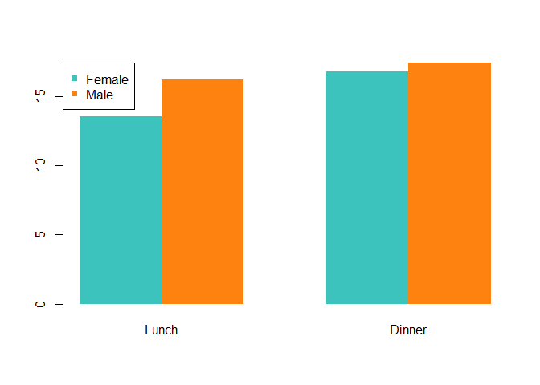
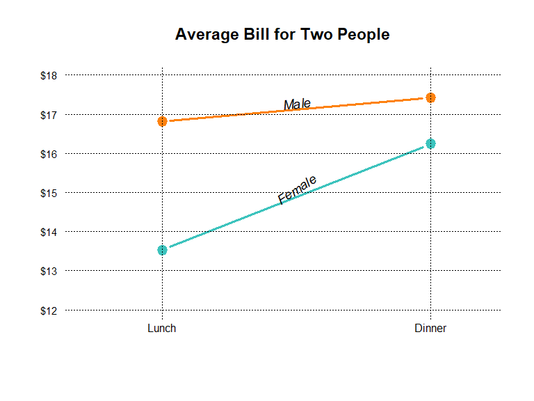
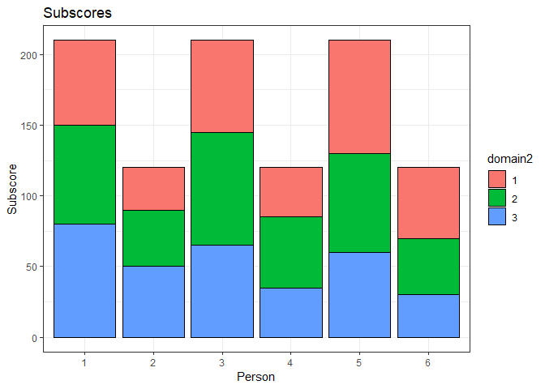
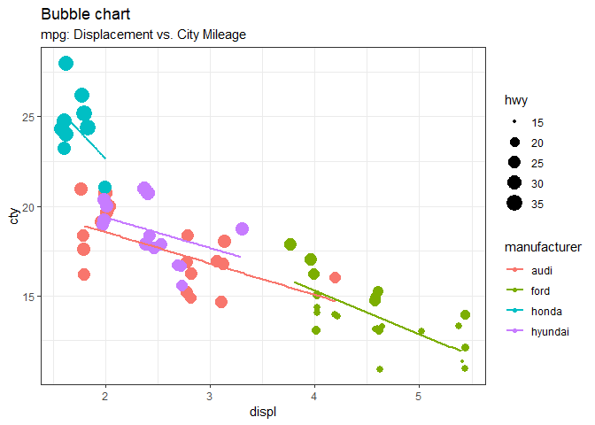
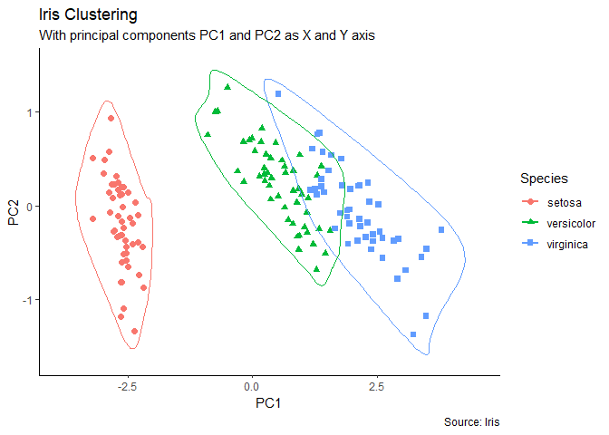

Data Visualization Using R
================

This document lists some of the visualizations I have created using the R base graphics as well as the **gglot2** and **lattice** packages. There are also visualizations that I have selected from other R users' posts on the web.

Visualizations with the R base graphics
---------------------------------------

``` r
billdata1 <- data.frame(
  sex = factor(c("Female","Female","Male","Male")),
  time = factor(c("Lunch","Dinner","Lunch","Dinner"), levels=c("Lunch","Dinner")),
  total_bill = c(13.53, 16.81, 16.24, 17.42)
)

billdata2 <- matrix(billdata1$total_bill,
                    nrow = 2,
                    byrow=TRUE,
                    dimnames = list(c("Female", "Male"), c("Lunch", "Dinner")))

mf_col <- c("#3CC3BD", "#FD8210")
barplot(billdata2, beside = TRUE, border=NA, col=mf_col)
legend("topleft", row.names(billdata2), pch=15, col=mf_col)
```



``` r
par(cex=1.2, cex.axis=1.1)
matplot(billdata2, type="b", lty=1, pch=19, col=mf_col,
    cex=1.5, lwd=3, las=1, bty="n", xaxt="n",
    xlim=c(0.7, 2.2), ylim=c(12,18), ylab="",
    main="Average Bill for Two People", yaxt="n")

axis(2, at=axTicks(2), labels=sprintf("$%s", axTicks(2)), 
     las=1, cex.axis=0.8, col=NA, line = -0.5)
grid(NA, NULL, lty=3, lwd=1, col="#000000")
abline(v=c(1,2), lty=3, lwd=1, col="#000000")
mtext("Lunch", side=1, at=1)
mtext("Dinner", side=1, at=2)
text(1.5, 17.3, "Male", srt=8, font=3)
text(1.5, 15.1, "Female", srt=33, font=3)
```



Visualizations with lattice
---------------------------

### Example 1

``` r
# Activate the lattice package
library("lattice")
library("latticeExtra")

# Change the header color to grayscale
sb <- trellis.par.get("strip.background") 
sb[["col"]][1] <- "lightgray"
sb[["col"]][2] <- "dimgrey"
trellis.par.set("strip.background", sb)

outlierdata <- read.csv("outlierdata.csv", header = TRUE)

xyplot(RMSE ~ NumberofTests | OutlierMagnitude*OutlierPosition, group = Method, subset = OutlierMagnitude!="Outlier=0",
       data = outlierdata, pch=c(3,4), cex=1, xlab = "Number of Data Points", aspect=0.5, panel=panel.xyplot,
       layout = c(4,2), ylab="Bias", type = "p",
       scales=list(
                  x=list(at=seq(5, 12, by=1), limits=c(4,13)), 
                  y=list(at=seq(0, 8, by=2), limits=c(-1, 8))
                ),
        auto.key = list(columns = 2), 
       par.settings = list(superpose.symbol = list(pch = c(3,4), cex = 1.5, col = "black")))
```


### Example 2

``` r
parameterdata <- read.csv("parameterdata.csv", header = TRUE)
parameterdata$SampleSize <- as.factor(parameterdata$SampleSize)
parameterdata$TestLength <- as.factor(parameterdata$TestLength)

xyplot(Bias ~ TestLength | SampleSize, data = parameterdata, group = Parameter, xlab = "Test Length",
       type = "a", auto.key = list(corner=c(1,0.9), points = FALSE, lines = TRUE, columns=1), 
       par.settings = simpleTheme(lty=1:3, lwd=2, col = c("black")))
```


------------------------------------------------------------------------

Visualizations with ggplot2
---------------------------

### Example 1

``` r
library(ggplot2)
options(scipen=999)  # turn off the scientific notation
theme_set(theme_bw())  # pre-set the black & white theme.

profiledata <- read.csv("profiledata.csv", header=T)
profiledata$person <- as.factor(profiledata$person)

ggplot(data = profiledata, aes(x = domain, y = score, group = person, shape = person)) + geom_line() + 
  geom_point(size = 4, fill = "white") +
  theme(panel.background = element_rect(fill = 'white', colour = 'black'), 
        panel.grid.minor = element_blank(), 
        panel.grid.major = element_blank(), 
        axis.text = element_text(size = 12), 
        axis.title = element_text(size = 15)) +
  scale_x_discrete(name = "Domain", labels = c("A", "B", "C", "A", "B", "C", "A", "B", "C")) +
  scale_y_continuous(name = "Subscore", limits = c(25, 85),breaks = seq(20, 80, 10)) + 
  scale_shape_discrete(name = "Person") + 
  geom_text(data = profiledata, aes(x = domain, y = score, label = score), size = 3, vjust = -1.5)+
  geom_text(data = profiledata, aes(x = domain, y = score, label = pattern), size = 3, vjust = 2.5)
```


### Example 2

``` r
profiledata$domain2 <- rep(c("1", "2", "3"), 6)

ggplot(data=profiledata, aes(x=person, y=score, fill=domain2)) +
  geom_bar(colour="black", stat="identity") +
  xlab("Person") + ylab("Subscore") +
  ggtitle("Subscores")
```



### Example 3

The following examples are from [Selva Prabhakaran's website](http://r-statistics.co/Top50-Ggplot2-Visualizations-MasterList-R-Code.html). I am sharing some of the examples from this source. You can check out his [website](http://r-statistics.co/Top50-Ggplot2-Visualizations-MasterList-R-Code.html) for more detailed examples.

``` r
data("midwest", package = "ggplot2")

ggplot(midwest, aes(x=area, y=poptotal)) + geom_point(aes(col=state, size=popdensity)) + 
  geom_smooth(method="loess", se=F) + 
  xlim(c(0, 0.1)) + 
  ylim(c(0, 500000)) + 
  labs(y="Population", 
       x="Area", 
       title="Area vs. Population", 
       caption = "Source: midwest")
```


``` r
data(mpg, package="ggplot2")

mpg_select <- mpg[mpg$manufacturer %in% c("audi", "ford", "honda", "hyundai"), ]

g <- ggplot(mpg_select, aes(displ, cty)) + 
  labs(subtitle="mpg: Displacement vs. City Mileage", title="Bubble chart")

g + geom_jitter(aes(col=manufacturer, size=hwy)) + 
  geom_smooth(aes(col=manufacturer), method="lm", se=FALSE)
```



``` r
library(ggcorrplot)

# Correlation matrix
data(mtcars)
corr <- round(cor(mtcars), 1)

# Correlogram
ggcorrplot(corr, hc.order = TRUE, 
           type = "lower", 
           lab = TRUE, 
           lab_size = 3, 
           method="circle", 
           colors = c("tomato2", "white", "springgreen3"), 
           title="Correlogram of mtcars", 
           ggtheme=theme_bw)
```


``` r
# devtools::install_github("hrbrmstr/ggalt")
library(ggalt)
library(ggfortify)
theme_set(theme_classic())

# Compute data with principal components ------------------
df <- iris[c(1, 2, 3, 4)]
pca_mod <- prcomp(df)  # compute principal components

# Data frame of principal components ----------------------
df_pc <- data.frame(pca_mod$x, Species=iris$Species)  # dataframe of principal components
df_pc_vir <- df_pc[df_pc$Species == "virginica", ]  # df for 'virginica'
df_pc_set <- df_pc[df_pc$Species == "setosa", ]  # df for 'setosa'
df_pc_ver <- df_pc[df_pc$Species == "versicolor", ]  # df for 'versicolor'
 
# Plot ----------------------------------------------------
ggplot(df_pc, aes(PC1, PC2, col=Species)) + 
  geom_point(aes(shape=Species), size=2) +   # draw points
  labs(title="Iris Clustering", 
       subtitle="With principal components PC1 and PC2 as X and Y axis",
       caption="Source: Iris") + 
  coord_cartesian(xlim = 1.2 * c(min(df_pc$PC1), max(df_pc$PC1)), 
                  ylim = 1.2 * c(min(df_pc$PC2), max(df_pc$PC2))) +   # change axis limits
  geom_encircle(data = df_pc_vir, aes(x=PC1, y=PC2)) +   # draw circles
  geom_encircle(data = df_pc_set, aes(x=PC1, y=PC2)) + 
  geom_encircle(data = df_pc_ver, aes(x=PC1, y=PC2))
```



``` r
library(ggExtra)

data(mpg, package="ggplot2")

mpg_select <- mpg[mpg$hwy >= 35 & mpg$cty > 27, ]

g <- ggplot(mpg, aes(cty, hwy)) + 
  geom_count() + 
  geom_smooth(method="lm", se=F)

ggMarginal(g, type = "histogram", fill="transparent")
ggMarginal(g, type = "boxplot", fill="transparent")
```


